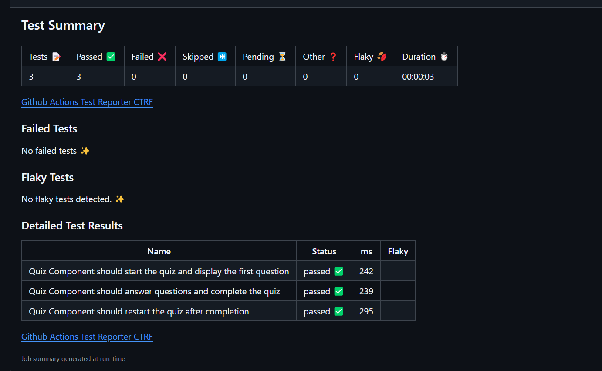

# Challenge-20 (Github actions Cypress Testing)

## Introduction

[](https://opensource.org/licenses/MIT)
[](https://github.com/ellerbrock/typescript-badges/)

This assigment is less of an application to be used and more of a demonstration of the "cypress-ctrf-json-reporter" package and the "github-actions-ctrf".


## Table of Contents

- [Required-Technologies](#required-technologies)
- [Installation](#installation)
- [Usage](#usage)
- [Code Snippet](#code-snippet)
- [Screenshots](#screenshots)
- [Features](#features)
- [Future-Features](#future-features)
- [License](#license)
- [Technologies](#technologies-used)


## Required Technologies

If you wish to install this project onto your system you can follow these steps.

This project requires node.js and its included node package manager.\
You can go to <a href="https://nodejs.org/en/download/package-manager">this</a> website to download node.js and npm. Just follow node's included download instructions!

MongoDB is also required to use this Project. You can follow <a href="https://www.mongodb.com/">this</a> to go to mongoDB's main site. Just follow their instructions on how to install mongoDB onto your system.

## Installation

Once the files are downloaded onto your machine open the project folder and run the terminal in the root directory.
To install the necessary dependencies run the "npm i" and the "npm run install" command to install the required files.

Once you have installed the needed dependencies navigate to the server folder and remove the ".EXAMPLE" extension from the .env.EXAMPLE file and save. Then run the "npm run seed" command to seed the database to ensure that the quiz has questions.

To start the application first run "npm run build" to build the server and client and then do "npm run start:dev" to run the server and the client. A list of extra commands is provided in the "package.json" file for additional commands.

## Usage

For this assignment we were tasked with adding cypress testing integration within our github actions tab. To view the bulk of this assignment navigate to the github actions tab within the repository and click on the development testing workflow and then click on the develop test. In the summary tab of this test you can see that below the job window you can see a ctrf formatted test. This shows the pass and fails of all the tests conducted in the Deploy job.

## Code Snippets

The code below is the entire deploy.yml file used as a part of testing and deploying. Here we have a job called "deploy". It's job is to test the application, then deploy the latest commit to our deployed site, and finally then upload the ctrf report to the github actions to be shown as a visual indicator of the completed tests.

These jobs only run on push and pull requests on branch "main".

```
# .github/workflows/deploy.yml
name: deployment testing

on:
  push:
    branches: [main]
  pull_request:
    branches:
      - main

jobs:
  deploy:
    runs-on: ubuntu-latest
    steps:
      - uses: actions/checkout@v3

      - name: Test
        run: |
          npm install
          npm run test-component

      - name: Deploy
        # Only run this step if the branch is main
        if: github.ref == 'refs/heads/main'
        env:
          deploy_url: ${{ secrets.RENDER_DEPLOY_HOOK_URL }}
        run: |
          curl "$deploy_url"

      #send results back to github
      - name: Test Summary Results
        run: npx github-actions-ctrf ctrf/ctrf-report.json

```

For this assignment to work a few other files had to be edited to integrate the ctrf summary file correctly. This is the cypress.config.ts file, within it we implemented the "cypress-ctrf-json-reporter" package to generate new report files upon each ran instance of cypress. Within the component section at "setupNodeEvents" a new event was added. The GenerateCtrfReport function is added. This runs every time cypress runs and generates a new ctrf file every ran instance. These files are read in the previous shown code snippet and then are appended to the github actions summary page.

```
import { defineConfig } from 'cypress';
import { GenerateCtrfReport } from 'cypress-ctrf-json-reporter'
import viteConfig from './vite.config';

export default defineConfig({
  component: {
    port: 5173,
    devServer: {
      framework: 'react',
      bundler: 'vite',
      viteConfig,
    },

    setupNodeEvents(on, _config){
      // implement node event listeners here
      new GenerateCtrfReport({
        on,
      })
    }
  },

  e2e: {
    baseUrl: 'http://localhost:3001',
    setupNodeEvents(on, _config) {
      // implement node event listeners here
    },
  },
});

```

## Screenshots

#### This is the Ctrf testing summary shown on the deploy.yml github actions summary.



## Features

Features include:

- Testing features
- Ctrf integration
- Branch protections
- Automatic deployment

## Future Features

Personally to me their is not much i can say should be added to this assignment. It does what it needs to do. In the future it may be maintained but as it is right now it is feature complete.

## License

Licensed under the MIT license.

## Technologies Used

<ul>
<li>Cypress test results tutorial <a href='https://medium.com/@ma11hewthomas/cypress-json-test-results-report-63a8a3092dd2'>here</a></li>
<li>Render Deploy hooks docs <a href="https://docs.render.com/deploy-hooks#example-workflow">here</a></li>
<li>Stack Overflow (For specific mongoose issues and ideas)</li>
<li>Node.js (for installing packages as well as building and running code).</li>
<li>Visual Studio Code (for writing code).</li>
<li>Mozila Web Docs and W3 Schools (for getting help with TypeScript).</li>
</ul>

